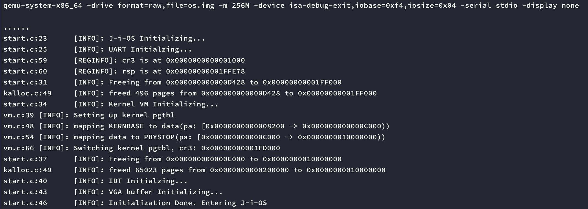

# J(i)OS
A 64 bit, amd64 compatible operating system from scratch.
The code contains a bootloader and a kernel. Currently kernel is able to allocate kernel heap memory.

Screenshot:

# Build and Run
## Prerequisite
You will need
    - qemu-system-x86_64
    - clang
    - ld.lld
    - nasm
    - (optional) clang-format
And thats it.

In kernel/Makefile, `LD` is set to `LD = /usr/local/Cellar/llvm/12.0.1/bin/ld.lld`
Use your path instead.

## Build and Run
After the preparation, under `some-path/J-i-OS`, run `make test` to run the O/S and get the output from stdout.

Or, run `make qemu` to run the O/S with a vga buffer, I DO NOT recommend this since all logging and output
are currently through uart to stdout.

Run `make format` to format the codes in GNU style.

# Directory
`boot` -> bootloader, from real mode -> protected mode -> long mode (referenced osdev.org)
`kernel` -> kernel code

# Run
`make qemu`:
    run in qemu, with display

`make test`:
    without display, uart output redirected to stdout

`make img`:
    build os.img from bootloader and kernel code

# Roadmap
- [x] bootloader
- [x] jump to C kernel
- [x] bigger kernel
- [x] VGA and uart
- [x] setup idt
- [x] sample breakpoint interrupt
- [x] remap pic
- [x] keyboard interrupt
- [x] timer interrupt
- [x] logger
- [x] printf
- [x] logging w/ file name & line number
- [x] kernel memory allocation
- [x] mmu
  - [x] switch kernel pgtbl when entered C
  - [x] page table walk
  - [x] page table setup and write to cr3
- [ ] process
  - [ ] proc struct
  - [ ] proc allocation
  - [ ] exec
- [ ] trap
  - [ ] serial interrupt control
- [ ] syscall
- [ ] user space
- [ ] scheduling

Not planned to do currently...
- [ ] filesystem
 - [ ] inode
 - [ ] initramfs
 - [ ] image file system

Ji Xinyou

# Acknowledgement
I write this OS project mainly for 2 reasons. First is for my personal interest on the bottom-up process
of a freestanding operating system. Second is to leave the git log for everyone looking at this repository, 
to check the developement process of this OS, most commit is bug-free, and being commented relatively clear.
During the development, I reference many tutorials and websites, including youtube tutorial by @Poncho, stackoverflow
questions, osdev wiki and github repo 64bit-os-tutorial, also borrowed some codes from xv6. I am here to thank every 
person that help me through the development by any means.

If you have found any bug or have any questions, please feel free to issue them in the github issue section, or
email me straight to jerryji0414[at]outlook[dot]com.
